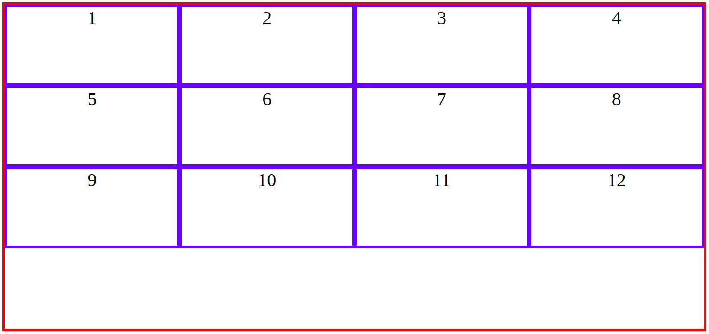
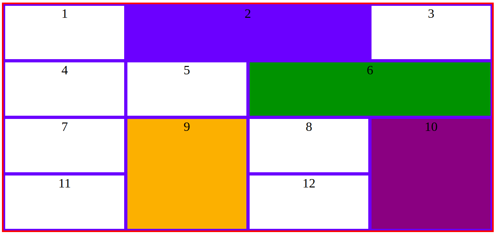

# Grid puzzle

## Step 1:

* Create a grid container
* Set 4 rows and 4 columns of equal size on the container and make sure that they take up **ALL available space**
* Give all items a border

## Step 2:

You NOW have an empty row at the bottom of your container. Select items and span them across columns and rows in order to fill that empty row.

> **Note**: only span 2 columns OR 2 rows at a time

